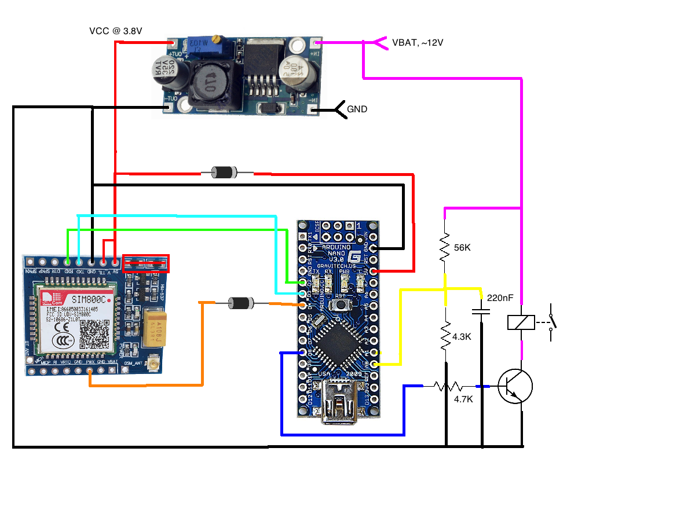

# GSMRemote

*Work in progress!. Expected to be finished in early January 2018.*

I started this project as a reliable way to power on the heater (a Webasto one) of my car. Remotes doesn't have sufficient range in some cases and some of them are qute expensive. The alternative is $10 of parts and an interesting challange. Main goals are:
* Minimal power consumption, let's not drain the battery for several weeks.
* On and off just by calling GSM number. This is free, SMS is not.
* Feedback if the call was received. A simple one would be different hangup intervals depending on the current state.
* Stable operation for long period (over 50 days). I.e. - not affected by internal timer rollover, no spontaneous resets.
* Automatic power off if the car engine is started up. The car VCC (a.k.a. VBAT) will get over 13V if the engine is running. If this happens - power off the heater.

## Hardware details
Required components:
* SIM800C module
* DC buck converter (or other efficient way to deliver over 2A current at ~3.8V)
* Arduino
* 12V relay, a few diodes, transistors and resistors.

## Wiring diagram

Still not completely tested. The VBAT measruing circuit may be modified, the other parts look fine. Almost any NPN transistor with sufficient Hfe should do the job. I'm using BC550C. The relay should be 12V one.

### Details

The cheap SIM800C I got was designed for 5V. There were two diodes (the one in red) that should lower the 5V below 4.2V (this is the highest acceptable voltage for SIM800C). Well, they didn't worked because even at 5.1V the voltage drop over them while the module was connecting to the network was so high, that the SIM800C VCC was getting below 3.3V and resetting. To resolve this - short circuit the diodes and run the remote at 3.8V. Both the Arduino (at 16MHZ) and the SIM800C operate totaly fine on 3.8V. Also remving the diodes and lowering the Arduino VCC should result in reduced power consumption.

The diode between 3.8V and the Arduino 5V pin is to protect the SIM800C in case the arduino is connected to a computer USB port. According the SIM800C datasheet 5V VCC should fry it. The diode should be a low drop one.

The diode between SIM800C PWR pin and Arduino D4 is again for protecting the SIM800C. It allows the arduino to bring the PWR pin low and to switch on/off the SIM800C. I used a low drop diode, but I suspect that even regular diode here would be fine.

## Programming the SIM800C

Several commands should be executed prior using the provided source code.
* ATE0&W -> Set ECHO to OFF and save the settings.
* AT+CLIP=1 -> Set CLIP mode to 1. This will provide the calling number on each RING.

## TODOs
* Measure the power consumption over 24 hours and publish the results.

## Update log

### 3 January 2018
The power LEDs were removed. After that the power consumption was measured:
* Step down converter - 7mA @ 12V
* SIM800C in sleep mode - from 0.5mA to 1.2mA @ 12V
* Arduino - 3.9mA @ 12V .

The step down converter current was measured with its output disconnected. So this 7mA are 100% only for it. A quick check in the datasheet of LM2596 shows quiescent current to be from 5mA to 10mA. Next step - find better regulator with higher efficiency. An MP2307 should do the job, the quiescent current there should be less than 1.5mA. Other option is MP1584 with quiescent current of 0.1mA.

The Arduino 3.9mA may be a bit incorrect as they don't consider what are the power losses in the stepdown converter. A better one would most likely reduce them. Also the build in 5V linear regulator may be removed, but the gains will be pretty small, so I'm most likely keeping it.

The initial target is less than 10mA @ 12V. Seems that with good voltage regulator I should be able to reach around 5-7mA @ 12V. Further optimization on the software may reduce them even more.

### 6 January 2018
Added the circuit for monitoring the external voltage. This is done by 2 resistors acting as voltage divider. The resistors are 55K and 4.3K. This should be consuming around 0.2mA at 12V. Since the resitance is a bit too high for reliable analog measurments a capacitor of 220nF was added between the analog pin and the ground. The result is quite stable external voltage reading.

Also started using the LowPower library to replace the delays with low power delays. The Arduino power consumption seems to be ~1.5mA @ 12V after this.